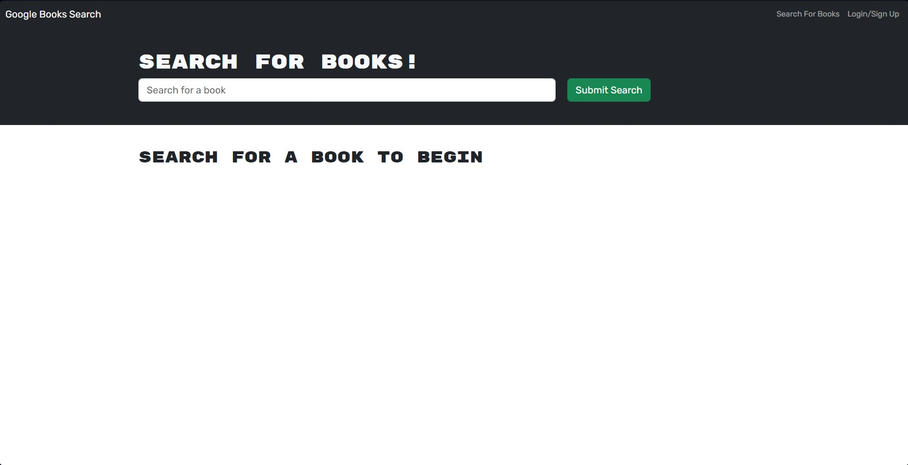

# Book Search Engine

## Description

Search engines often try to extend their searching capabilities to as many topics as possible. Often times, if a user is trying to find specific information about a topic, search engines may take into account all generally related things about that topic, when in reality the information given back to the user is not what they were looking for. As an avid reader of books, I enjoy finding new books to read, and I like convenient ways of finding books. With this Book Search Engine, it gives me information about exactly the books I search for.

## Usage

Check out my webiste here! 

Users have the ability to create their own profiles and search books using this app. Here's an example of what the application page looks like:

## License

MIT License